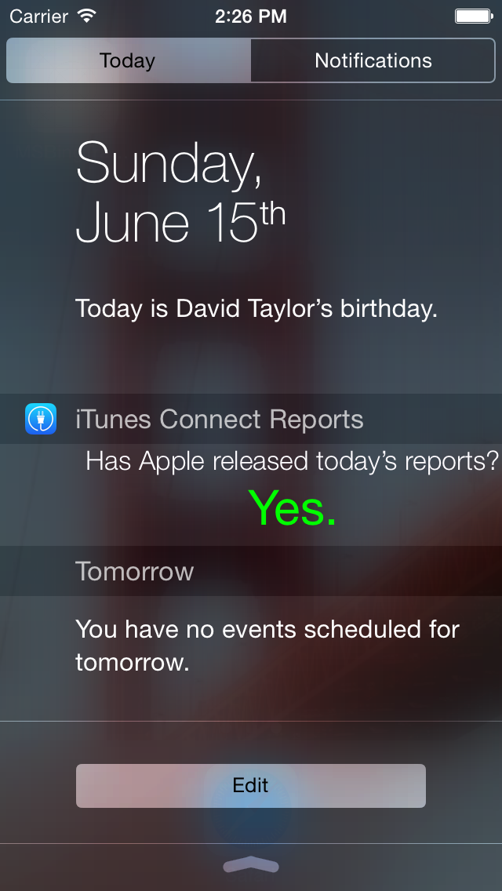

iTunesConnectReports-Extension
==============================

A very simple Today View extension for iOS 8 to check if today's iTunes Connect reports are already released.
I didn't find a nice API to check this. I usually use the <a href="http://www.appfigures.com/itcstatus" target="_blank">appfigures.com/itcstatus</a> website and then I saw that in the source code they have a "haveTodays" value that indicates if the today's reports are released or not. I scraped the HTML code and displayed the value. Very simple.
I've added the default iTunes Connect app icon too to give it a better look that the default blank icon. 

If you have any idea or improvement, send a pull request.

For any question, <a href="http://twitter.com/BalestraPatrick" target="_blank">@BalestraPatrick</a>.

